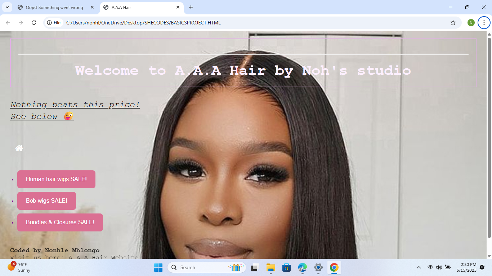

# 🌐 My HTML Landing Page

A clean and responsive landing page built using only **HTML** and **CSS**. This is one of my first front-end projects, created to practice layout structure, styling, and responsiveness.

---

## 📸 Preview

  
*(You can upload a screenshot of your page and name it `screenshot.png`)*

---

## ✨ Features

- Mobile-friendly layout
- Semantic HTML structure
- Custom styling with CSS
- Smooth and simple user interface

---

## 🛠️ Tech Stack

- HTML5
- CSS3

---

## 📁 Project Structure

my-html-landing-page/
├── index.html
├── styles/
│ └── style.css
└── README.md

yaml
Copy
Edit

---

## 🚀 Getting Started

To view the page locally:

1. Clone the repo:
   ```bash
   git clone https://github.com/nonhle98/my-html-landing-page.git
Open index.html in your browser.

📌 Future Improvements
Add JavaScript interactivity (e.g., form validation, animations)

Improve accessibility and performance

Connect to a backend or deploy as a real product

📬 Contact
Made with ❤️ by Nonhle Mhlongo
📧 Email: nonhlemhlongo.ae@gmail.com
